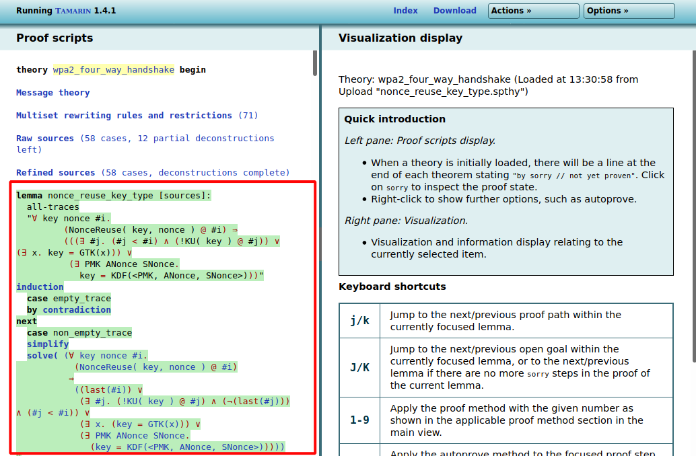

# USENIX Artifact for Submission #653

This repository contains all files and explanations for the USENIX artifact evaluation of Paper #653: *A Formal Analysis of IEEE 802.11’s WPA2: Countering the Kracks caused by Cracking the Counters*.

In our paper, we discuss a formal model of the WPA2 protocol which we created with the automated-reasoning tool [Tamarin](https://tamarin-prover.github.io/). As claimed in our paper, the proofs for most lemmas defined in our formal model (all except for three) can be automatically found with Tamarin. 

In this repository, we provide a virtual-machine image (for VirtualBox) that contains a Tamarin installation and related scripts so that reviewers can reproduce the proofs and check their validity. Moreover, the repository also contains the manually created proofs so that reviewers can check their validity too. Below, we describe all the necessary steps to perform the evaluation.

# Requirements

The evaluation of our artifact requires the [VirtualBox](https://www.virtualbox.org/) virtualization software. The virtual-machine image we provide below has a maximum memory of 14 GB—a machine with 16 GB of memory should therefore be enough for performing the evaluation.

# Steps to Evaluate the Artifact

## Downloading the VirtualBox Image

You can download our VirtualBox image via the following link: [VirtualBox Image for Submission 653](https://dl.cispa.saarland/s/m7KQ3GdQ9E4jNry/download).

## Generating the Proofs with Tamarin

To generate the proofs for all the lemmas of our formal model, proceed as follows:

1. Start the Virtual Machine (the operating system should not ask you for a username or password; in case it does, use the username *usenix_653* and the password *usenix*).

2. Open a terminal and go to the directory *~/Code/wpa2_model* (Command: `cd ~/Code/wpa2_model`).

3. The formal model is defined in the file *~/Code/wpa2_model/wpa2_four_way_handshake.m4*. To generate the proofs, execute the script *~/Code/wpa2_model/proof_generation/generate_proofs.sh* (Command: `proof_generation/generate_proofs.sh`). Note that it is important to call this script from the directory *~/Code/wpa2_model* and not from some other directory.

4. The proofs for the lemmas will now be generated. The status of each lemma is printed to the terminal. Overall, this should take around one hour on a machine with 16 GB of memory—this is a bit faster than the original experiments described in our paper, because we included reviewer suggestions that led to a decrease in runtime. (Note that our script calls Tamarin via the tool [UT Tamarin](https://github.com/benjaminkiesl/ut_tamarin); UT Tamarin is a wrapper for Tamarin that allows the convenient generation of multiple proofs).

When the script is finished, all automatically generated proofs can be found in the directory *~/Code/wpa2_model/automatic_proofs*. The manual proofs (there are three) can be found in the directory *~/Code/wpa2_model/manual_proofs*. 

There is exactly one file per lemma, and each file is named after the corresponding lemma. For example, the proof for the lemma *supplicant_ptk_is_secret* can be found in the file *~/Code/automatic_proofs/supplicant_ptk_is_secret.spthy*.

Each proof file contains the whole formal model as well as all the lemmas. Only the lemma for which a proof was generated also has a corresponding proof in the file (for the other lemmas, no proof is in the file).

## Inspecting Proofs with Tamarin

To inspect proofs, you can use the so-called *interactive mode* of the Tamarin prover. The interactive mode can be started as follows:

1. Call the command `tamarin-prover interactive .` from within the directory *~/Code/wpa2_model*.

2. Start the Firefox browser and open the URL http://localhost:3001 (note that the bookmark **Tamarin Interactive** in Firefox's bookmarks tab also links to that URL).

3. Load a proof file by clicking **Browse...**, then choosing one of the proofs from the folder **~/Code/wpa2_model/automatic_proofs** and then clicking **Load new theory**:

4. The proof file should now show up in the list of lemmas (see below). By clicking on the theory name for a given file, you can open the file. Note that this can take a while for larger proofs:

5. Once a proof file has been loaded successfully, the list of lemmas is shown on the left of the page. Scroll to the corresponding lemma to see its proof. If a proof is colored green and ends with *qed*, it means that Tamarin could successfully check the correctness of the proof:

### Contact

In case you have any questions regarding our artifact, don't hesitate to contact Benjamin Kiesl via the email address `benjamin[dot]kiesl[at]gmail.com`.
